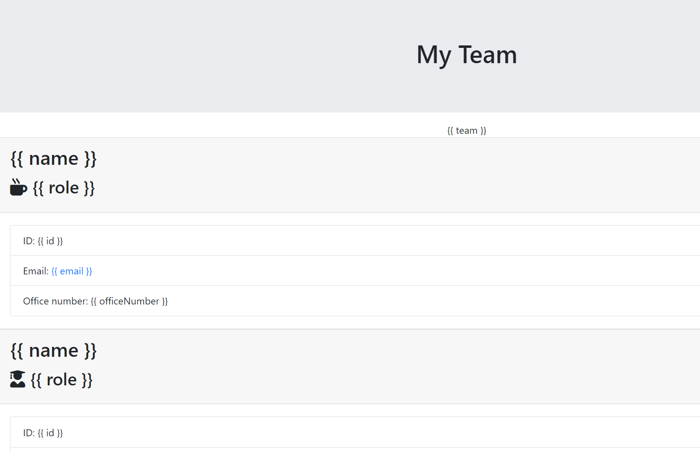

# EmployeeChart
A manager can create a profile for themselves and anyone working under them. 
 
JS produces an HTML file with the manager and team listed.
 
# Installation
Required: Inquirer
# Difficulties
I ran into the issue of my code not being able to replace my shell HTML. 

# Photos

